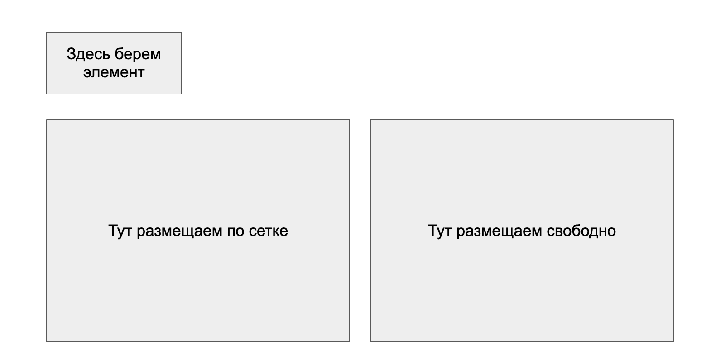

# Домашнее задание

Реализовать **drag'n'drop** элементов с помощью курсора мыши либо касанием пальца на тач-устройстве.

## Требования

- **Зона, создающая новый элемент при перетаскивании** — из этой области пользователь «вытягивает» новый элемент.

- **Элемент** — квадрат **100×100 px** случайного цвета.

- **Область при перетаскивании**, в которую элементы располагаются **в соответствии с сеткой** — зона, куда можно перетаскивать элементы; они выстраиваются по сетке.

- **Область, сохраняющая положение перемещённого в неё элемента** — после отпускания элемент остаётся в том месте, куда его положили.

- **Поведение при отпускании мимо зон** — если элемент отпущен **мимо** вышеописанных областей, он **исчезает**.

## Пример

Схема зон (источник элемента, размещение по сетке, свободное размещение):

## Как делать
* Сделать форк этого репозитория
* Создать новую ветку. Название любое.
* Сделать в ней домашнее задание, пушнуть в ветку.
* Создать пулреквест на github
* Прислать ссылку на пулреквест мне в личку в mattermost (Максим Гатилин)

## Сроки
* Софт-дедлайн: 27 марта включительно
* Хард-дедлайн: 3 апреля включительно
